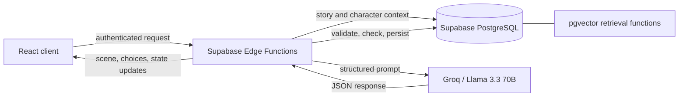

# Scribis

AI-powered interactive storytelling for narratives that evolve through meaningful player choices.

> Selected theme: **July Challenge: Reimagine Creative Industries with AI**.

## Problem statement

Interactive stories are difficult to create and maintain. Writers must plan branching paths, preserve character continuity, track unresolved plot threads, and prevent later scenes from contradicting earlier decisions. Most generative writing tools produce isolated passages rather than a coherent, explorable story world.

Scribis addresses the gap between free-form AI writing and structured interactive fiction. It gives writers and players a way to create branching narratives while retaining control over characters, tone, content boundaries, and story state.

## Solution description

Scribis is a full-stack web application where users can:

- Define a story's title, genre, setting, tone, and narrative guardrails.
- Create characters with roles, traits, biographies, relationships, and character-specific rules.
- Generate scenes and multiple consequential choices with AI.
- Enter custom choices instead of following only predefined branches.
- Track plot threads, clues, character state, branches, and savepoints.
- Review the complete narrative as an interactive story map.
- Export a story as Markdown or structured JSON.

The application combines a guided writing workflow with persistent branching state, allowing AI-generated scenes to remain part of a manageable narrative rather than becoming disconnected text.

## AI approach and architecture

Scribis uses Groq-hosted `llama-3.3-70b-versatile` through server-side Supabase Edge Functions. API credentials are never exposed to the browser.

The AI layer consists of three Edge Functions:

- `generate-scene` builds context-aware prompts from project settings, active characters, previous scenes, player choices, plot state, and guardrails. It requests structured JSON, retries failed or unsuitable generations, checks lexical overlap to reduce repetition, records consistency issues and guardrail violations, then persists the scene and choices.
- `ai-polish` improves setting descriptions, character descriptions, and guardrail wording while preserving the author's intent.
- `suggest-traits` proposes character traits from the supplied character context.

PostgreSQL stores projects, characters, scenes, choices, branches, savepoints, relationships, and evolving story state. Row-level security isolates each user's data. The schema also includes pgvector-backed `match_scenes` and `match_characters` functions for semantic retrieval as the narrative grows.

## Selected challenge theme

**July Challenge: Reimagine Creative Industries with AI**

Scribis reimagines creative writing by turning generative AI into a collaborative storytelling engine. The model is not treated as an unrestricted text generator: users establish the world and its boundaries, while the system supplies contextual scenes, choices, and writing assistance. This keeps the creator in control and makes AI part of an iterative creative workflow.

## How IBM Bob was used

IBM Bob was the sole AI development assistant used to build Scribis. It supported the complete development workflow, including repository exploration, architecture planning, frontend and backend implementation, database and Edge Function development, code refinement, debugging, and documentation. All product decisions and final changes remained under human direction and review.

IBM Bob is a development tool rather than part of Scribis at runtime. The application's user-facing AI features are provided by the Groq-backed Supabase Edge Functions described above.
